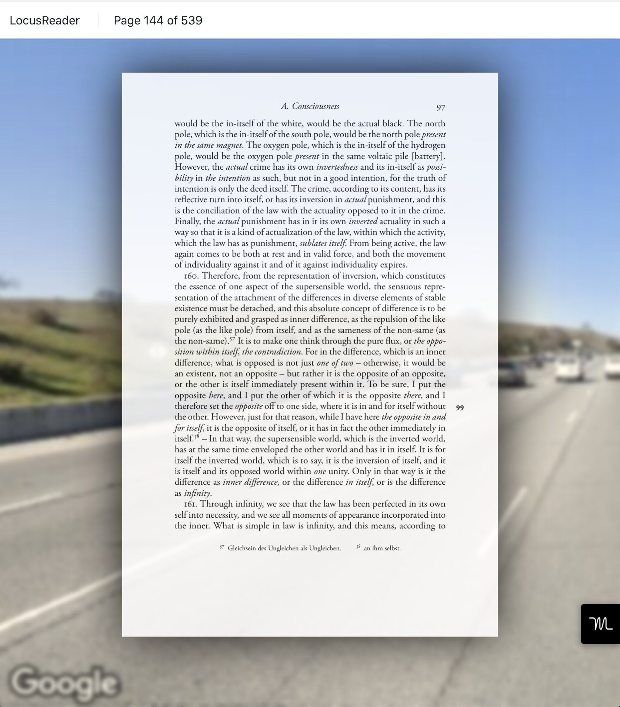

# Locusreader v0.2.0

Locusreader is an e-reader that uses the method of loci to make long PDFs tolerable for visual thinkers. The current version specifies the route and PDF in environment variables, but these should be relatively easy to change.

To develop:

```
REACT_APP_API_KEY=[API KEY GOES HERE] \
REACT_APP_ORIGIN="650 Mayfield Ave" \
REACT_APP_DESTINATION="SFO" \
REACT_APP_PATH="/phaenomenologie.pdf" \
npm run start
```

# Screenshot


